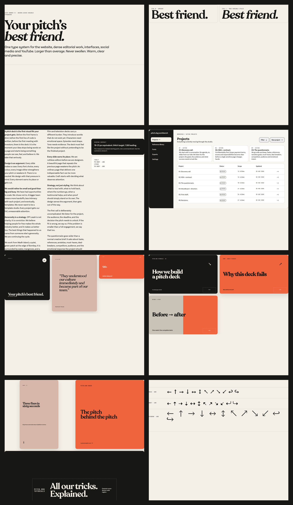
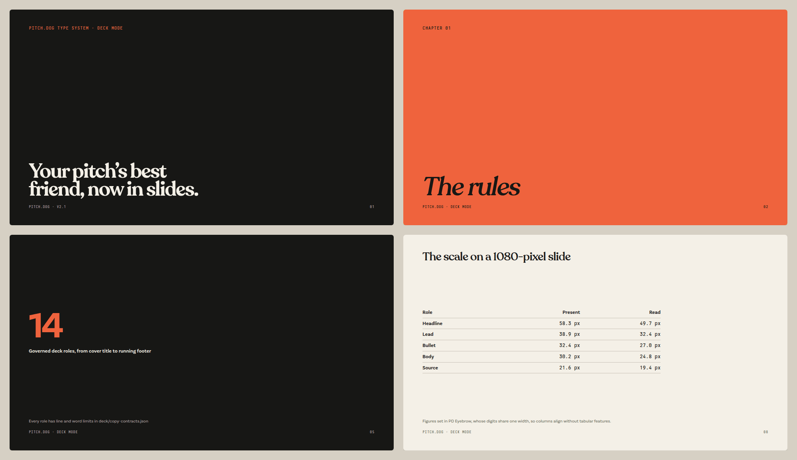
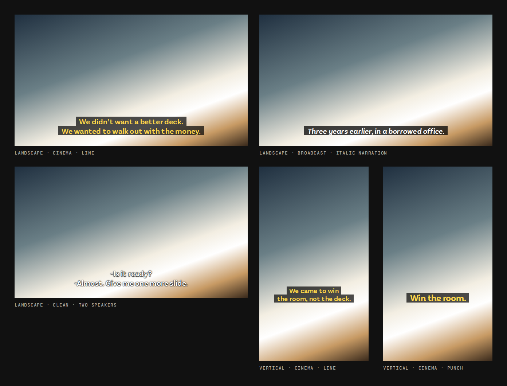

# pitch.dog Type System

The canonical source for pitch.dog typography: five variable font families, semantic type tokens, production CSS, and the roles that govern the website, product interfaces, social posts, YouTube and pitch decks.

Current release: **v3.0.0**



## What is inside

| Path | What it is |
| --- | --- |
| `tokens/pitchdog.system.tokens.json` | Canonical semantic source. Every other surface derives from it. |
| `scripts/build_dist.py` | Regenerates every derived token, contract, type and media-CSS file from the canonical source. |
| `dist/pitchdog-system.css` | Complete production CSS (fonts, typography, UI, social, YouTube, decks). |
| `dist/pitchdog-system.ts` | Typed anchors, role names and the release version. |
| `assets/fonts/` | The seven runtime WOFF2 files the CSS loads. |
| `pitchdog-font-handoff/` | Web, native and static-fallback fonts for design tools and apps. Git checkout only. |
| `interface/`, `social/`, `youtube/`, `deck/` | Component, canvas and copy contracts, each with a starter HTML page. |
| `docs/` | Specification, policies, platform guides and validation evidence. |
| `pitchdog-typography-system.html` | The live specimen. Open it from a checkout to see every layer with the real fonts. |
| `skills/pitchdog-type-system/` | An agent skill that routes type work back to this repository. |

## The families

| Family | Role | Axes |
| --- | --- | --- |
| PD Head | Display and headings | `wght` 265–900, `ital` 0–1 |
| PD Head Alt | Alternate display voice | `wght` 265–900, `ital` 0–1 |
| PD Body | Reading and interface text (Roman and Italic files) | `wght` 100–900 |
| PD Body Alt | Alternate reading voice (Roman and Italic files) | `wght` 100–900 |
| PD Eyebrow | Labels, metadata, data and arrows | `wght` 100–900, `wdth` 87.5–100, `ital` 0–1 |

Production values snap to authentic master anchors; see `docs/ANCHOR-POLICY.md`. From v2.0.0 every font file installs under these names on desktop and native platforms too; see `docs/FONT-NAMING.md`.

## Use it in a project

These integration instructions describe mechanics for pitch.dog and its authorized collaborators; they do not grant a public licence to the surrounding system.

Pin a release. Do not depend on `main`.

```json
{
  "dependencies": {
    "@pitchdog/type-system": "git+https://github.com/bomkino/pitchdog-type-system.git#v3.0.0"
  }
}
```

Load the complete system once:

```js
import "@pitchdog/type-system/system.css";
```

Or load the layers separately, fonts and typography first:

```js
import "@pitchdog/type-system/fonts.css";
import "@pitchdog/type-system/typography.css";
import "@pitchdog/type-system/ui.css";
import "@pitchdog/type-system/social.css";
import "@pitchdog/type-system/youtube.css";
import "@pitchdog/type-system/deck.css";
```

`ui.css`, `social.css`, `youtube.css` and `deck.css` are not standalone; they consume variables declared by `typography.css`.

The CSS resolves the seven WOFF2 files from this package. Let your bundler copy and fingerprint them with the rest of its assets. Do **not** hotlink `raw.githubusercontent.com` URLs in a browser: GitHub is the source and distribution point, not a runtime CDN.

For web wrapping and reading measure, use the semantic roles or the explicit `data-pd-wrap` and `data-pd-measure` contracts. Do not put `text-wrap: pretty` on `body`, every paragraph, or an entire application shell. See `docs/WEB-TEXT-WRAPPING.md`.

For space between text blocks, put `data-pd-flow` on the column that holds them: headings sit closer to the text they introduce, and paragraphs are spaced by their own size. The scale and the rules are in `docs/SPACING.md`.

Frameworks, non-JavaScript projects, vendoring and native apps are covered in `docs/USING-IN-PROJECTS.md`. Upgrading from 2.x: `docs/MIGRATION-v2-to-v3.md`. From 13.x: `docs/MIGRATION-v13-to-v2.md` first.

## Decks

Deck mode sets slides with the same families and voice: fourteen roles, 16:9 and 4:3 canvases, a **present** density for slides shown live and a **read** density for decks sent as a PDF. Sizes are measured from the slide, so a deck looks the same in a browser, on a projector and in print.



```html
<section data-pd-deck-canvas="widescreen">
  <div data-pd-deck-safe>
    <p data-pd-deck="kicker">Series A · 2026</p>
    <h1 data-pd-deck="title">Your pitch’s best friend.</h1>
  </div>
</section>
```

Start from `deck/deck-starter.html`: ten slides with canvas, density and head-tone switches, a full-screen presenter mode and one-click PDF export. `docs/DECKS.md` has the full scale, writing rules, and point sizes for Keynote, PowerPoint, Google Slides and Figma.

## Subtitles

Subtitles set dialogue in PD Body SemiBold on 16:9, 4:3, square and vertical frames, in three styles: **broadcast** (white on a black box), **cinema** (yellow on a see-through black box) and **clean** (white with an outline, no box). Sizes follow the BBC's line-height guidance and the line limits follow Netflix's.



```html
<div data-pd-subtitle-frame="landscape" data-pd-subtitle-style="cinema">
  <p data-pd-subtitle-cue>
    <span data-pd-subtitle="line">We didn’t want a better deck.</span>
    <span data-pd-subtitle="line">We wanted to walk out with the money.</span>
  </p>
</div>
```

Start from `subtitle/subtitle-starter.html`. `docs/SUBTITLES.md` has the sizes for burning subtitles in with Premiere Pro, DaVinci Resolve, Final Cut Pro or CapCut, the writing rules and the WebVTT setup.

## Fonts for design tools and apps

Each GitHub Release attaches:

- `pitchdog-fonts-<tag>.zip` — the seven runtime WOFF2 files
- `pitchdog-font-handoff-<tag>.zip` — the full handoff: web and native variable fonts plus static fallbacks
- `pitchdog-type-system-skill-<tag>.zip` — the agent skill

The handoff's `05-DOCUMENTATION/FONT-MANIFEST.json` records version 2.0.0, the last release that changed a font file; later releases ship the same fonts until one changes them. Every asset has a `.sha256` sidecar. Variable fonts are authoritative; static fonts are compatibility fallbacks. Never install the variable and static versions of the same family together.

## Documentation

`docs/README.md` indexes every document by task. The main ones:

- `docs/SPECIFICATION.md` — full behaviour and role specification
- `docs/ANCHOR-POLICY.md`, `docs/GOVERNANCE.md` — what values are allowed and how changes are controlled
- `docs/UI-UX-TYPOGRAPHY.md`, `docs/DENSE-TEXT.md`, `docs/WEB-TEXT-WRAPPING.md`, `docs/SPACING.md` — interface, reading and spacing guidance
- `docs/SOCIAL-TYPOGRAPHY.md`, `docs/YOUTUBE.md`, `docs/DECKS.md`, `docs/SUBTITLES.md` — media canvases, slides and subtitles
- `docs/HEAD-ITALICS.md`, `docs/ARROWS.md` — family-specific behaviour
- `docs/FONT-NAMING.md`, `docs/KNOWN-FONT-DETAILS.md`, `docs/FIGMA-MAPPING.md` — fonts in design tools and native apps
- `docs/ACCESSIBILITY-QA.md`, `docs/VALIDATION-REPORT.md` — verification

## Agent skill

`skills/pitchdog-type-system/` is a model-invoked skill for any task that touches typography, fonts, text hierarchy, semantic type roles, wrapping, measure or rendered text. It resolves this repository at an immutable commit and reads the canonical values from `tokens/`, `dist/` and `docs/` rather than copying them.

Resolve the release tag to its full commit, then install from that commit:

```bash
pitchdog_release_commit="$(git ls-remote https://github.com/bomkino/pitchdog-type-system.git 'refs/tags/v3.0.0^{}' 'refs/tags/v3.0.0' | tail -n1 | cut -f1)"
if ! printf '%s' "$pitchdog_release_commit" | grep -Eq '^[0-9a-f]{40}$'; then
  echo "Could not resolve v3.0.0 to one full commit." >&2
  exit 1
fi
python3 /path/to/skill-installer/scripts/install-skill-from-github.py \
  --repo bomkino/pitchdog-type-system \
  --path skills/pitchdog-type-system \
  --ref "$pitchdog_release_commit" \
  --method download
```

Confirm the v3.0.0 GitHub Release records that commit before installing.

For Claude, upload the Release's `pitchdog-type-system-skill-<tag>.zip` as a skill; for Claude Code, unzip it into `~/.claude/skills/`. Replace the installed copy on each release, since an older copy keeps routing to older documents.

## Repository maintenance

These commands need a full Git checkout, not the lean package installed into web projects.

```bash
python3 scripts/build_dist.py --check           # derived files match the tokens (needs Node.js)
python3 scripts/verify_repository.py            # everything: package, fonts, handoff, contracts, checksums
python3 -m pip install -r tools/requirements.txt
python3 tools/normalize_font_names.py --check assets/fonts pitchdog-font-handoff
```

The verifier rejects missing or altered fonts, unexpected font locations, broken package exports, malformed JSON, a damaged handoff and system-contract regressions. CI runs all three on every push and pull request. After changing the tokens, run `python3 scripts/build_dist.py` to regenerate the derived files, then `python3 scripts/checksums.py --write`.

To rebuild the fonts from the accepted FontBlind source archive (or its generated v13 handoff ZIP):

```bash
python3 scripts/populate_fonts.py /path/to/FontBlind-Final-2026-08-28-v13.zip --replace
```

It rebuilds the handoff, applies the v2 name normalization, and refuses the result unless every hash matches the committed release.

## Versioning and releases

- Pin projects to an immutable tag or commit.
- Patch: fixes that preserve font metrics and role contracts.
- Minor: additive roles or tokens.
- Major: any font binary, metric, axis, family-name or existing role change that can reflow layouts or change native registration.
- Merging a version bump to `main` publishes the Release automatically (`.github/workflows/release.yml`).
- Never commit source archives, access tokens, `.npmrc`, or `.env` files.

Numbering restarted at **2.0.0** after 13.1.1, the last release of the "lucky number 13" line. Tools that sort versions will list 13.x above 2.x, so pin by tag and use the GitHub Release marked latest.

## Contributing and security

See `CONTRIBUTING.md` for how changes are proposed and checked, and `SECURITY.md` for reporting a vulnerability privately.

## Rights

Font binaries in `assets/fonts/` and `pitchdog-font-handoff/` are dedicated under **CC0 1.0 Universal**. They may be used, changed and redistributed without an attribution requirement; keep `FONT-LICENSE.md` with handoffs as a provenance best practice.

The surrounding type-system code, tokens, documentation, examples, artwork and pitch.dog branding remain all-rights-reserved material. See `LICENSE.md` and `FONT-LICENSE.md` for the exact scope.

This GitHub repository is publicly visible. Public visibility does not change the all-rights-reserved status of the surrounding system or expand the font-only CC0 boundary.
